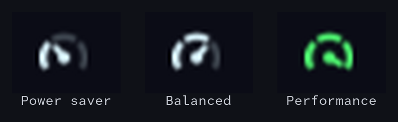

<div align="center">


# omarchy-power-profile

**A power profile gauge for the Omarchy bar: scroll over it to switch between power saver, balanced and performance.**
For [Omarchy](https://omarchy.org) / Hyprland.

[](https://omarchy.org)
[](#how-it-works)
[](LICENSE)
[](README.de.md)



</div>

---

## What it shows

A small gauge with three segments. The lit segments and the needle show the active profile:

| Gauge | Profile |
|---|---|
| ◔ 1 of 3 lit | **Power saver** |
| ◑ 2 of 3 lit | **Balanced** |
| ● 3 of 3 lit, accent colour | **Performance** |

## Controls

| | |
|---|---|
| 🖱️ **Scroll up / down** | More / less power. Stops at both ends, touchpads step once per full notch |
| 👆 **Left click** | Cycle to the next profile |
| 🔋 **Middle / right click** | Open the Omarchy power panel |

## Install

```bash
omarchy plugin add https://github.com/vsvito420/omarchy-power-profile.git --enable
```

That clones it to `~/.config/omarchy/plugins/vsvito.power-profile` and puts the widget on the bar.
To move it, for example right after the battery:

```bash
omarchy bar move vsvito.power-profile --after omarchy.power
```

Update with `omarchy plugin update vsvito.power-profile`, remove with `omarchy plugin remove vsvito.power-profile`.

## How it works

- **Reading:** the active profile comes live from `power-profiles-daemon` through Quickshell's `PowerProfiles` service,
  so the gauge also follows changes made elsewhere (power panel, `powerprofilesctl`).
- **Switching:** goes through `omarchy-powerprofiles-set`, just like the Omarchy power panel. Omarchy remembers the choice
  separately for AC and battery and restores it when you plug in or unplug.
- **Drawing:** the gauge is painted with a `Canvas` in the bar's colours, so it fits whatever Omarchy theme you use.

## Requirements

- Omarchy with the Quickshell based shell (bar widgets via `~/.config/omarchy/plugins/`)
- `power-profiles-daemon` (included with Omarchy)

## License

[MIT](LICENSE) © 2026 vsvito420
